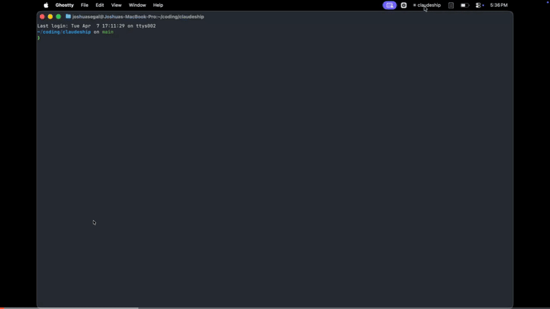

# claudeship

A Claude Code plugin suite for sandboxed workspace orchestration, multi-account workflows, usage tracking, safety hooks, and cross-platform interactive notifications.



## Features

### Workspace Orchestration

Manage isolated git worktrees per feature branch, with configurable lifecycle scripts that run your project's setup and teardown commands.

The plugin handles the scaffolding (worktree creation, copying `.env` and `.claude/`, generating a workspace-scoped `CLAUDE.md` and `.workspace/` planning artifacts)

Project-specific logic (installing deps, starting services, cleaning up) lives in shell scripts your repo owns, wired up through a `.claudeship.json` config.

```jsonc
// .claudeship.json at your repo root
{
  "workspace": {
    "lifecycle": {
      "setup":    "bash .claudeship/setup.sh",     // runs after worktree is created
      "run":      "bash .claudeship/run.sh",       // starts services
      "teardown": "bash .claudeship/teardown.sh"   // runs before worktree is removed
    }
  }
}
```

Scripts receive `$WORKSPACE_PATH`, `$WORKSPACE_NAME`, and `$MAIN_CHECKOUT`. All three hooks are optional.

Workspaces are driven through MCP tools the plugin exposes to Claude. Ask something like *"spin up a workspace for the auth refactor"* and it'll call the right ones:

| Tool | What it does |
|------|--------------|
| `workspace_suggest` | Policy gate — decides whether a task warrants a workspace and suggests a name |
| `workspace_create` | Creates the worktree + branch and runs `setup` → `run` lifecycle |
| `workspace_open` | Launches a new Claude Code session in the worktree (Ghostty tab on macOS, detached spawn elsewhere) |
| `workspace_list` | Lists all workspaces with branch and last-commit info |
| `workspace_status` | Detailed status for one workspace — commits ahead/behind, last commit |
| `workspace_destroy` | Runs `teardown` and removes the worktree + branch |

Further terminal support for `workspace_open` is welcome.

#### Starters

Pre-built lifecycle script sets for common project shapes live under `starters/`. Copy one into your repo and edit the marked variables:

| Starter | Directory | What it does |
|---------|-----------|-------------|
| Docker + Traefik | `starters/docker-traefik/` | Shared Traefik reverse proxy, per-workspace Docker Compose routing via `*.lvh.me`, health checks |

```bash
cp -r starters/docker-traefik/.claudeship .claudeship/
cp starters/docker-traefik/.claudeship.json .claudeship.json
# then edit .claudeship/*.sh to match your services and ports
```

Contributions of new starters welcome — each one is a directory with a `.claudeship.json`, a `.claudeship/` script set, and a short `README.md`.

### Multi-Account Management

Run multiple Claude Code accounts (work, personal, school) side by side. Each account gets its own config directory, color-coded indicator, and shell alias.

### Usage Tracking

Track daily, weekly, and monthly spend and token counts across all accounts. Supports per-account breakdowns and history views via `/usage`. Usage is estimates since Anthropic removed cost_USD from session outputs, so make sure to check your real usage from time to time.

### Safety Hooks

Lifecycle hooks that protect your environment out of the box even in dangerous permissions modes:

- **Dangerous command blocking** — prevents `rm -rf /`, `push --force`, `reset --hard`, `curl | sh`, and more
- **File protection** — blocks edits to `.env`, lockfiles, `docker-compose.yml`, and `terraform/`
- **Auto-formatting** — runs Prettier, Ruff, gofmt, or rustfmt on changed files at the end of each turn

### Notifications (ClaudeNotifier)

A notification daemon that shows live session status, subagent progress, and interactive notifications.

- **macOS** — native Swift menubar app (`notifier/ClaudeNotifier.swift`), installed via Homebrew cask
- **Linux** — Python asyncio daemon (`notifier/daemon/claudeship-notifier.py`) with a Waybar adapter in `notifier/adapters/waybar/`

Both provide:

- Color-coded account indicator with a braille spinner for active sessions
- Clickable session panel — click to focus the matching terminal window
- Interactive notifications for permission requests and questions — respond without switching to the terminal
- Subagent progress tracking (`"Agent done (2/5)"`)


### Statusline

Custom status bar showing account info, git branch, model, and context usage — with spend tracking for API accounts and rate usage for subscription accounts.

## Installation

### 1. Install the plugins

```bash
/plugin marketplace add josh-segal/claudeship
/plugin install claudeship
/plugin install claudeship-workspaces   # optional
```

### 2. Install ClaudeNotifier (optional)

**macOS:**

```bash
brew tap josh-segal/claudeship https://github.com/josh-segal/claudeship
brew install --cask claude-notifier
```

After install, grant notification permissions:
**System Settings > Notifications > Claude Notifier** — set style to Banners or Alerts.

**Linux:**

```bash
bash notifier/install.sh
```

Symlinks the daemon and Waybar adapter into `~/.local/bin` and optionally creates a systemd user service. See `notifier/adapters/waybar/` for module config and CSS snippets.

### 3. Run setup

```
/setup
```

The setup wizard walks you through configuring the statusline, registering accounts, and verifying the notifier connection.

## License

MIT License

Copyright (c) 2026 Joshua Segal

Permission is hereby granted, free of charge, to any person obtaining a copy of this software and associated documentation files (the "Software"), to deal in the Software without restriction, including without limitation the rights to use, copy, modify, merge, publish, distribute, sublicense, and/or sell copies of the Software, and to permit persons to whom the Software is furnished to do so, subject to the following conditions:

The above copyright notice and this permission notice shall be included in all copies or substantial portions of the Software.

THE SOFTWARE IS PROVIDED "AS IS", WITHOUT WARRANTY OF ANY KIND, EXPRESS OR IMPLIED, INCLUDING BUT NOT LIMITED TO THE WARRANTIES OF MERCHANTABILITY, FITNESS FOR A PARTICULAR PURPOSE AND NONINFRINGEMENT. IN NO EVENT SHALL THE AUTHORS OR COPYRIGHT HOLDERS BE LIABLE FOR ANY CLAIM, DAMAGES OR OTHER LIABILITY, WHETHER IN AN ACTION OF CONTRACT, TORT OR OTHERWISE, ARISING FROM, OUT OF OR IN CONNECTION WITH THE SOFTWARE OR THE USE OR OTHER DEALINGS IN THE SOFTWARE.
